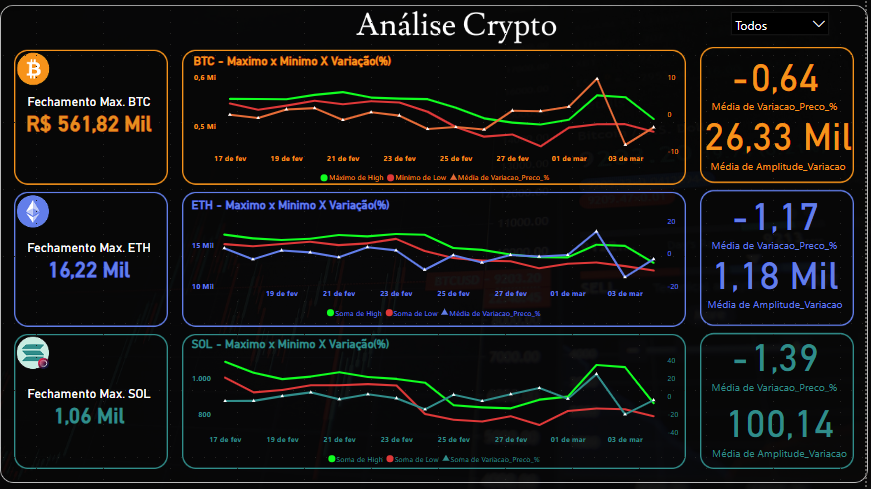

# Coleta e Armazenamento de Dados de Criptomoedas

## Descrição

Este projeto é uma aplicação Python capaz de acessar a API pública da Binance para extrair informações relevantes sobre criptomoedas, como preços, capitalização de mercado, volume de negociação e outras métricas. Os dados extraídos são processados e armazenados no Google BigQuery para posterior análise. Também foi criado um dashboard no Power BI para visualizar esses dados.

## Funcionalidades

- **Coleta dados históricos de criptomoedas (Bitcoin, Ethereum e Solana) da API da Binance.**
- **Processamento dos dados com pandas e numpy.**
- **Envio dos dados para o Google BigQuery para análise.**
- **Visualização interativa dos dados no Power BI.**

## Tecnologias e Ferramentas

- **Python 3.13.2**
- **Jupyter Notebook**
- **Pandas**
- **Numpy**
- **Google Cloud BigQuery**
- **Binance API**
- **Power BI**

## Pré-requisitos

### Conta no Google Cloud Platform (GCP)
- É necessário ter uma conta no GCP e criar um projeto no Google BigQuery. Você precisará das credênciais da sua conta de serviço para autenticação.

### Conta na Binance API
- Você precisa de uma chave de API (`api_key` e `api_secret`) da Binance para acessar os dados.

## Instalação das Dependências

1. Clone o repositório:
   ```bash
   git clone https://github.com/vitordatauser/teste_tecnico_cadastra.git

2. Navegue até o diretório do projeto:
    ```bash
    cd teste_tecnico_cadastra
3. Instale as dependências:
     ```bash
    %pip install google-cloud
    %pip install pyarrow
    %pip install google-cloud-bigquery
    %pip install pandas-gbq
    %pip install python-binance

## Arquivo de Credenciais do GCP

Para acessar o Google BigQuery, você deve baixar o arquivo de credenciais (.json).Crie um projeto no GCP, ative o BigQuery API e gere um arquivo de credenciais. Coloque este arquivo na raiz do projeto.

## Variáveis de Ambiente

Adicione suas credenciais da API Binance no ambiente:
    
    ```bash
    export api_key_binance="SUA_API_KEY"
    export api_secret_binance="SUA_API_SECRET"

## Como Rodar o Projeto

1. Crie um ambiente virtual para o Python:

    ```bash
    python -m venv venv

2. Ative o ambiente virtual
3. Abra o notebook etl_API_Crypto.ipynb e execute as células para começar a coletar e processar os dados das criptomoedas.

## Explicação do Código
Conexão com a API da Binance
No código, a API da Binance é acessada utilizando a biblioteca python-binance. A conexão é feita utilizando a chave de API e o segredo da Binance que você deve configurar no seu ambiente. O código coleta dados históricos de criptomoedas como Bitcoin, Ethereum e Solana.

# Tratamento de Dados
Os dados são extraídos utilizando a função get_historical_klines da Binance e convertidos em um dataframe do pandas. O tratamento dos dados inclui a conversão de timestamps para o fuso horário de São Paulo, a criação de novas métricas (como a variação do preço e amplitude da variação), e a seleção das colunas necessárias para análise.

Envio para o Google BigQuery
Após o processamento dos dados, os dados são enviados para o Google BigQuery utilizando a função to_gbq da biblioteca pandas_gbq. Os dados são armazenados nas tabelas btc, eth e sol no projeto do BigQuery.

Visualização no Power BI
Com os dados armazenados no Google BigQuery, você pode usar o Power BI para visualizar os dados e criar dashboards interativos. No Power BI, basta usar o conector do Google BigQuery, fazer login na sua conta do GCP e selecionar o banco de dados com os dados coletados. Você pode criar gráficos e relatórios para analisar as criptomoedas.

Exemplo de Uso
Após rodar o código, você poderá acessar o BigQuery para visualizar os dados coletados. No Power BI, você pode visualizar gráficos como abaixo:



